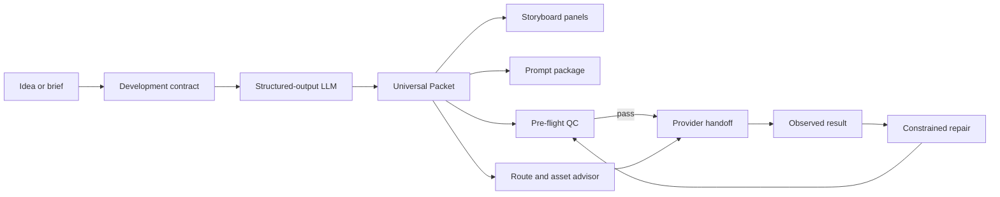

# AUTEUR Frameworks

[](https://github.com/shrishmanglik/auteur-frameworks/actions/workflows/ci.yml)
[](LICENSE)
[](package.json)
[](#frameworks)

**Turn an idea into one complete AI-video production kit: story, scenes, shot list, storyboard, references, sound, prompts, route decisions, pre-flight, and repair.**

AUTEUR Frameworks is a provider-neutral TypeScript toolkit for developers, filmmakers, ad directors, creators, and AI-tool builders. It makes production intent explicit before a prompt reaches a video, image, or audio model.

It is software, not a prompt dump. The private research corpus is not published.

## Why this exists

Most generation failures start before generation:

- the story has no causal spine;
- a shot contains several competing actions;
- time is described vaguely rather than as visible beats;
- optics, lighting motivation, physics, audio, and continuity are underspecified;
- a repair prompt redesigns the shot instead of fixing one defect;
- provider limits are guessed and presented as fact.

AUTEUR stores those decisions in one validated **Universal Packet**. The complete production kit, storyboards, prompt packages, QC, routing advice, and repairs are deterministic projections of that packet.

Development requests accept and deterministically route every current AUTEUR format enum: short film, ad, reel, A-roll, B-roll, music video, product film, character scene, VFX, animation, image, sequence, and custom work. Executable fixtures currently validate full packet-to-kit behavior for product film, short film, vertical reel, and A-roll; other routes have exact framework-selection tests but do not yet have equivalent end-to-end fixtures. No route claim means every provider will execute every instruction correctly.

## Two-minute start

Requirements: Node.js 20 or newer.

```bash
# Install directly from the public GitHub repository.
npm install github:shrishmanglik/auteur-frameworks#main

# See every command.
npx auteur-frameworks help

# Build the complete production kit for the included product-film example.
npx auteur-frameworks kit \
  node_modules/auteur-frameworks/examples/product-film.json \
  --out production-kit.json
```

The output includes the creative brief, story, scene plan, character and world bibles, style bible, visual storyboard, shot list, sound plan, continuity matrix, reference-asset manifest, route advice, generation prompts, pre-flight, repair catalog, and export manifest.

> npm registry publication is intentionally deferred while the public API stabilizes. Git installs run the package build automatically.

## Start from a raw idea

Use a development request to create a schema-bound contract for any structured-output LLM:

```bash
npx auteur-frameworks develop \
  node_modules/auteur-frameworks/examples/requests/short-film.json \
  --out development-contract.json
```

Send these three fields to the model or orchestration layer you control:

- `systemInstruction`
- `userBrief`
- `responseSchema`

Save the model's JSON response as `production.json`, then run:

```bash
npx auteur-frameworks validate production.json
npx auteur-frameworks kit production.json --out production-kit.json
```

The toolkit does not call an LLM or generation provider for you. This keeps credentials, spend, routing, and provider claims in the host application where they belong.

## CLI

```text
auteur-frameworks frameworks
auteur-frameworks develop <request.json> [--out result.json]
auteur-frameworks validate <packet.json> [--out result.json]
auteur-frameworks preflight <packet.json> [--out result.json]
auteur-frameworks storyboard <packet.json> [--out result.json]
auteur-frameworks compile <packet.json> [--out result.json]
auteur-frameworks kit <packet.json> [--out result.json]
auteur-frameworks continue <continuation.json> [--out result.json]
auteur-frameworks score-render <observation.json> [--out result.json]
auteur-frameworks compare-renders <before.json> <after.json> [--out result.json]
auteur-frameworks help
auteur-frameworks version
```

Errors name both the problem and the corrective action. Commands return non-zero exit codes when input or validation fails, so the CLI can sit inside CI, agents, and automation pipelines.

## TypeScript API

```ts
import {
  buildDevelopmentContract,
  buildProductionKit,
  buildRepairPrompt,
  buildStoryboard,
  compileContinuationPrompt,
  compilePacket,
  parseUniversalPacket,
  preflightPacket,
} from "auteur-frameworks";

const packet = parseUniversalPacket(yourStructuredProduction);
const preflight = preflightPacket(packet);

if (!preflight.passed) {
  throw new Error(JSON.stringify(preflight.issues, null, 2));
}

const storyboard = buildStoryboard(packet);
const promptPackage = compilePacket(packet);
const productionKit = buildProductionKit(packet);

const repair = buildRepairPrompt({
  failure: "OBJECT_CONSERVATION",
  observedSymptom: "The hero glass disappears after the pour begins.",
  preserve: ["camera move", "lighting direction", "glass geometry"],
});

const extension = compileContinuationPrompt(yourRenderObservedContinuation);
// Submit extension.prompt only after its source final frame is attached or selected.
```

## What ships

- **Universal Packet and continuation JSON Schemas** for story, scenes, shots, characters, capture stack, optics, lighting, materials, physics, timing, performer and facial controls, bounded spoken-performance windows, vocal locks, audio, continuity, exclusions, and render-observed handoffs.
- **Development contract** that turns a brief into model instructions plus JSON Schema.
- **Framework-native deterministic compiler** whose prose, JSON, timing, stunt, transformation, continuous-take, and audio architectures change with the selected framework; the full surface preserves that structure, the compact surface reports whenever budgeting degrades it, and generated reference-frame prompts carry an affirmative clean-surface lock.
- **Complete production-kit compiler** that projects story, scenes, bibles, storyboard, shot list, sound, references, continuity, prompts, QC, repairs, and exports in one call.
- **Risk-aware route advisor** that splits delayed terminal reveals into a lexically isolated pre-reveal pass plus a render-observed continuation; directs causal contact, mechanical assembly, multi-subject dynamics, and precise spatial clearance to first/last-frame workflows; isolates exact fluid counts and compound constraint overload into split passes; and routes identity or brand control to reference-first workflows. A deterministic constraint budget blocks short shots that combine too many fragile controls, rather than pretending more prose will fix the route. Provider support remains `UNKNOWN` until the host verifies it.
- **Storyboard projection** with ordered panels, action, camera, duration, continuity, audio, and distinct opening/terminal frame-generation instructions. Explicit `frameStates.opening` data owns the opening asset; without it, the compiler labels and warns on a minimal fallback instead of copying a composite scene into frame zero. The legacy `framePrompt` aliases the opening state.
- **Pre-flight QC** for temporal coverage, production duration, scene ownership, continuity, audio, typography risk, and realism anchors.
- **Repair engine** for identity drift, anatomy, topology, object loss, broken physics, lip sync, branding, material drift, and other recurring defects.
- **Measured refinement loop** with a typed render-observation schema, weighted scoring, a relative-improvement gate, and fail-closed audio verification before a render can become a production candidate.
- **Render-observed continuation compiler** with a match-frame instruction, first-motion deadline, physical spatial bridge, single-camera-path guard, time-boxed dialogue cue, and final-frame handoff. Provider output must still be audited; the instruction is not a frame-match guarantee.
- **Four executable creator fixtures** covering a product film, short film, vertical reel, and A-roll monologue.
- **CLI and typed API** designed for local tools, agents, desktop apps, servers, and CI.

## Frameworks

| Framework | Best used for |
| --- | --- |
| Cinematic Prose Stack | Premium product shots, ads, B-roll, and character moments |
| Act and Shot Master Spec | Short films, sequences, music videos, and narrative ads |
| JSON Scene Contract | Parseable, versioned production handoffs |
| Avatar A-Roll JSON Contract | Referenced speakers, exact monologues, restrained facial performance, vocal locks, and clean handoffs |
| Temporal Evolution | Transformations, animation, and VFX state changes |
| Timed Social Sequence | Reels, hooks, reveals, and loopable short-form work |
| Practical Stunt Contract | Mass, contact, momentum, and camera choreography |
| Continuous Take | Character scenes, B-roll, product actions, and other unbroken takes |
| Constrained Repair Pass | One-defect corrections that preserve shot identity |
| Audio Contract | Dialogue, sound hierarchy, sync, acoustic space, and music boundaries |
| Render-Observed Continuation | Sequential extensions grounded in the actual previous final frame |

List the machine-readable registry:

```bash
npx auteur-frameworks frameworks
```

The framework ID is executable structure, not a display tag. See [Framework-Native Prompt Architectures](docs/framework-architectures.md) for the exact block order, routing rules, compact-prompt fidelity gate, and evidence-specific repair/continuation boundary.

## Creator test matrix

| Point of view | Executable fixture | What the tests protect |
| --- | --- | --- |
| Narrative director | [`examples/short-film.json`](examples/short-film.json) | causal beats, scene ownership, continuity, choice, audio |
| Commercial director | [`examples/product-film.json`](examples/product-film.json) | material truth, product geometry, optics, settling physics |
| Vertical creator | [`examples/vertical-reel.json`](examples/vertical-reel.json) | first-second hook, 9:16 route, timing, loop, text risk |
| A-roll operator | [`examples/a-roll.json`](examples/a-roll.json) | JSON performance manifest, facial limits, exact speech, vocal lock, eye line, room sound |
| Tool integrator | [`examples/requests/`](examples/requests/) | raw brief to schema-bound LLM contract |

Run the full matrix:

```bash
git clone https://github.com/shrishmanglik/auteur-frameworks.git
cd auteur-frameworks
npm ci
npm run check
```

## Production model



Structured data is the source. Prompts and storyboards are compiled artifacts, not competing documents.

## Provider handoff

The compiler is provider-neutral by default. It does **not** fabricate duration limits, native-audio support, pricing, aspect-ratio support, API availability, or prompt-length ceilings.

At handoff time:

1. select one compiled shot;
2. set aspect ratio and duration explicitly in the provider UI or adapter;
3. submit the framework-native `videoPrompt`; use `compactVideoPrompt` only after its report confirms no required section or safeguard was lost;
4. use `openingFramePrompt` for reference-first generation; use `terminalFramePrompt` only when the route explicitly supports a terminal or first/last-frame asset (`framePrompt` remains an alias for the opening state); for `DELAYED_TERMINAL_REVEAL`, dispatch `buildDelayedRevealSplitPlan(...).preReveal.prompts` and never the original single-pass prompt;
5. keep `negativePrompt` and continuity locks attached to the job record;
6. for an extension, describe the actual final frame and compile a render-observed continuation; a delayed reveal stays blocked until the pre-reveal render has been accepted and observed;
7. record observed defects and compile a constrained repair.

See [Provider Handoff](docs/provider-handoff.md).

## LLM and agent integration

AUTEUR can be called from Codex, Claude Code, Gemini CLI, shell-capable agents, MCP tools, Node services, desktop apps, or local model orchestrators. The host tool only needs to run the CLI or import the package.

See [LLM Integration](docs/llm-integration.md) and [`llms.txt`](llms.txt).

## Evidence boundary

The methodology was developed from 1.5 years of private prompt-and-render research and validated against **6,069 rendered outputs from a 6,086-record corpus; 17 source records lacked a corresponding render file and were excluded**.

Not published:

- raw prompts;
- generated image, video, or audio assets;
- per-output extraction records;
- internal identifiers;
- prompt-to-output mappings;
- private source paths or credentials.

This repository contains generalized frameworks, original source code, synthetic examples, tests, and aggregate methodology. The validation statement describes the evidence base; it does not claim universal success across every model, provider, format, or future version. See [Research Boundary](docs/research-boundary.md).

## Reliability gates

`npm run check` executes:

1. JSON Schema generation;
2. strict TypeScript checking;
3. unit and creator-persona tests;
4. production build;
5. local documentation-link validation;
6. source and generated-output publication-boundary scans;
7. exact npm tarball manifest audit;
8. isolated packed-consumer import and CLI smoke;
9. package dry run.

Runtime dependencies are audited separately in CI.

## Project map

| Path | Purpose |
| --- | --- |
| [`src/schemas.ts`](src/schemas.ts) | Universal Packet and development-request contracts |
| [`src/frameworks.ts`](src/frameworks.ts) | Framework registry and evidence classes |
| [`src/development.ts`](src/development.ts) | Raw-brief to LLM contract compiler |
| [`src/compiler.ts`](src/compiler.ts) | Prompt package compiler |
| [`src/continuation.ts`](src/continuation.ts) | Render-observed extension compiler |
| [`src/storyboard.ts`](src/storyboard.ts) | Storyboard panel projection |
| [`src/production-kit.ts`](src/production-kit.ts) | Complete production-kit projection |
| [`src/route-advisor.ts`](src/route-advisor.ts) | Risk-aware generation-route and asset advice |
| [`src/qc.ts`](src/qc.ts) | Pre-flight checks and corrective actions |
| [`src/repair.ts`](src/repair.ts) | Constrained failure repair |
| [`schemas/`](schemas/) | Generated Universal Packet and continuation JSON Schemas |
| [`examples/`](examples/) | Synthetic production and request fixtures |
| [`docs/`](docs/) | Quickstart, integration, evaluation, and architecture guides |

## Documentation

- [Quickstart](docs/quickstart.md)
- [Architecture](docs/architecture.md)
- [LLM integration](docs/llm-integration.md)
- [Provider handoff](docs/provider-handoff.md)
- [Production kit](docs/production-kit.md)
- [Evaluation methodology](docs/evaluation.md)
- [Research and publication boundary](docs/research-boundary.md)
- [Contributing](CONTRIBUTING.md)
- [Governance](GOVERNANCE.md)
- [Security](SECURITY.md)
- [Support](SUPPORT.md)
- [Roadmap](ROADMAP.md)

## Contributing

Framework proposals are welcome. A contribution must identify a production problem, declare its evidence class and scope, include a falsification condition, add synthetic fixtures, and pass the publication boundary.

Start with [CONTRIBUTING.md](CONTRIBUTING.md) or open a [framework proposal](https://github.com/shrishmanglik/auteur-frameworks/issues/new?template=framework-proposal.yml).

## Status

Version `0.8.0` is an early public API. Provider adapters and commercial execution remain outside core. Breaking changes will be documented in [CHANGELOG.md](CHANGELOG.md) until the API reaches `1.0.0`.

## License and citation

Apache-2.0. See [LICENSE](LICENSE).

For research or published implementations, cite the repository using [`CITATION.cff`](CITATION.cff).
